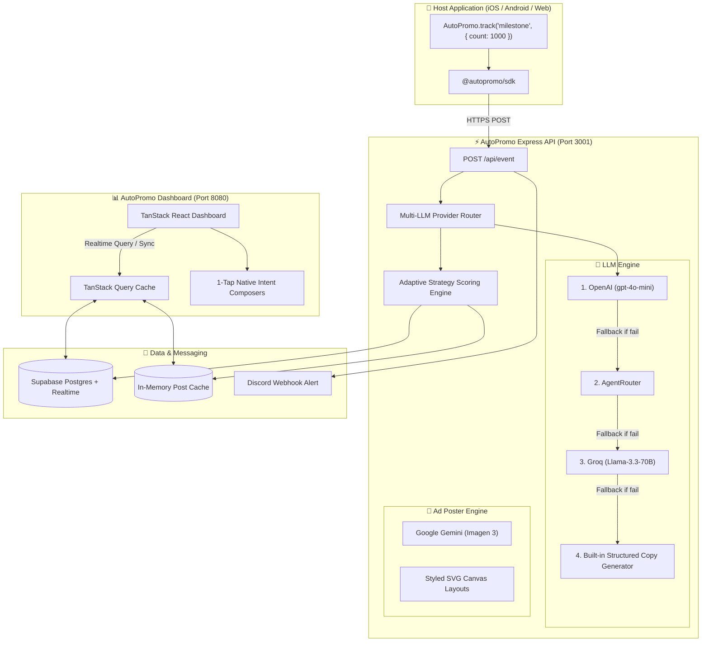
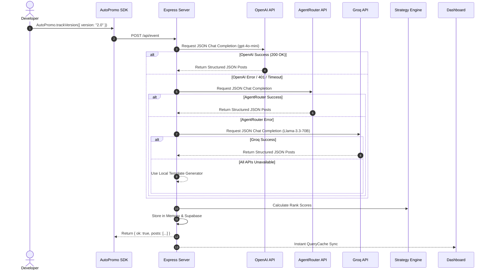

# ⚡ AutoPromo SDK

<div align="center">


**The AI-Driven Promotion Layer for Mobile & Web Applications**  
*Turn real product moments into high-converting social copy, rank variants with an adaptive strategy engine, and publish in 1-tap with Zero ToS Risk.*

[Explore Features](#-key-features) • [System Architecture](#-system-architecture) • [SDK Integration](#-3-line-sdk-integration) • [Local Setup](#-local-development) • [API Reference](#-environment--configuration)

</div>

---

## 📸 Overview & Live Pages

AutoPromo is a drop-in developer SDK and intelligent analytics dashboard that automatically transforms internal product milestones (app launches, version releases, 5★ user reviews, download goals) into platform-optimized promotional posts and ad artwork.

### Why AutoPromo?
* 🛡️ **Zero ToS Risk**: No fragile browser automation or risky unofficial APIs. AutoPromo generates pre-filled native platform intent compose URLs (`twitter.com/intent/tweet`, `wa.me`, `linkedin.com/sharing`). A human always makes the final 1-tap approval.
* 🧠 **Multi-LLM Provider Engine**: Built-in resilient fallback pipeline favoring **OpenAI `gpt-4o-mini`**, **AgentRouter**, and **Groq `Llama-3.3-70B`**.
* 🎨 **Ad & Poster Studio**: Integrates **Google Gemini Imagen 3** for AI background artwork and visual poster rendering across 1:1 Square, 16:9 Landscape, and 9:16 Story formats.
* 📊 **Adaptive Strategy Engine**: Scores post variants continuously based on historical user publishing choices ($\text{Score} = \text{Base Weight} + 0.5 \times \frac{\text{Chosen}}{\text{Shown}}$).

### Live Demo Navigation

| Page / Feature | Route Path | Description |
|---|---|---|
| **Landing & Pricing** | `/` | Showcase, feature matrix, and sandbox subscription plans |
| **All Apps Directory** | `/apps` | Multi-app overview and one-click app connection |
| **App Studio & Feed** | `/apps/:appId` | Live event triggers, ranked posts grid, and ad studio |
| **Ad & Poster Studio** | `/apps/:appId/ads` | AI image generator & custom poster builder |
| **Event Variant Detail** | `/apps/:appId/events/:eventId` | Complete breakdown of every variant generated for an event |
| **Strategy Analytics** | `/analytics` | Platform/Tone performance metrics and ranking breakdown |
| **Live Terminal Feed** | `/live/:appId` | Dark-mode terminal view for live event streaming |
| **SDK Documentation** | `/docs` | Interactive SDK test playground and downloadable `sdk.ts` |
| **Settings & Billing** | `/settings` | App API keys, plan subscription management, and billing receipts |
| **OG Share Cards** | `/share/:eventId` | OpenGraph preview cards for social link sharing |

---

## 🏗️ System Architecture

AutoPromo operates across four decoupled layers: the host application (Mobile/Web), the client SDK, the resilient Express API backend, and the TanStack Start React dashboard.

### 1. High-Level Architecture Flow



---

### 2. Multi-LLM Provider Fallback Pipeline

AutoPromo guarantees 100% uptime for post generation by implementing a sequential fallback cascade across LLM providers:



---

### 3. Strategy Engine Formula

Every generated post variant receives a dynamic ranking score computed by the Strategy Engine:

$$\text{Score} = \text{BaseWeight}(\text{Event}, \text{Platform}) + 0.5 \times \left( \frac{\text{Times Chosen}}{\text{Times Shown} + 1} \right)$$

```mermaid
gantt
    title Strategy Engine Score Weights Distribution
    dateFormat X
    axisFormat %s
    
    section Starting Base Weight
    Twitter Base        :0, 90
    LinkedIn Base       :0, 85
    Reddit Base         :0, 80
    WhatsApp Base       :0, 75
    
    section Human Engagement Boost
    User Clicks "Publish":90, 140
```



---

## ✨ Key Features

### 🚀 1. 3-Line SDK Integration
Drop `@autopromo/sdk` into any React, React Native, Expo, Node.js, or HTML web app. SDK calls are asynchronous and fail-safe—they will never block or crash the host application.

### 🤖 2. Multi-LLM Copy Generation
Generates platform-tailored promotional copy for **Twitter/X**, **LinkedIn**, **Reddit**, **WhatsApp**, **Telegram**, and **Facebook** in two tones (**Casual & Viral** vs **Professional & Clear**).

### 🖼️ 3. AI Ad & Poster Studio
Uses **Google Gemini Imagen 3** to render high-resolution promotional artwork. Customize text briefs, badge accents, vibe palettes, and export in **Square (1:1)**, **Landscape (16:9)**, or **Story (9:16)** formats.

### 🛡️ 4. 1-Tap Human-in-the-Loop Compose Intents
Generates native platform deep links so developers can review, edit, and publish with a single click:
* **Twitter/X**: `twitter.com/intent/tweet?text=...`
* **LinkedIn**: `linkedin.com/sharing/share-offsite/?url=...`
* **Reddit**: `reddit.com/submit?title=...&text=...`
* **WhatsApp**: `wa.me/?text=...`
* **Telegram**: `t.me/share/url?url=...&text=...`
* **Facebook**: `facebook.com/sharer/sharer.php?u=...`

### 📢 5. Discord Webhook Broadcaster
Optionally broadcasts every new event and AI-generated social thread to your team's Discord channel instantly.

---

## 📦 3-Line SDK Integration

### 1. Installation
```bash
npm install @autopromo/sdk
```

### 2. Initialize
```typescript
import { AutoPromo } from "@autopromo/sdk";

AutoPromo.init({
  appId: "ap_live_2b81ef40c7aa", // From AutoPromo Dashboard -> Settings
  apiUrl: "http://localhost:3001", // Or your production backend URL
  appUrl: "https://focustimer.app",
});
```

### 3. Track Product Moments
```typescript
// 🚀 Major Product Release
await AutoPromo.trackVersion({
  build: "v2.0.0",
  notes: "Added Dark Mode and 50% faster export speeds!",
});

// ⚡ Milestone Reached
await AutoPromo.trackMilestone({
  label: "10,000 Active Users",
  count: 10000,
});

// ⭐ 5-Star Review Highlight
await AutoPromo.trackReview({
  rating: 5,
  author: "Sarah M.",
  text: "The best productivity app I've used this year!",
});

// 🎯 Fetch & Publish Top Ranked Post
const { posts } = await AutoPromo.trackEvent("launch");
if (posts && posts.length > 0) {
  await AutoPromo.openShareSheet(posts[0].content);
}
```

---

## 🛠️ Supported Platforms & Intent Mapping

| Platform | Composition Strategy | Primary Intent Target |
|---|---|---|
| **Twitter / X** | Web Intent Deep Link | `https://twitter.com/intent/tweet?text={content}` |
| **LinkedIn** | OG Share Card Integration | `https://www.linkedin.com/sharing/share-offsite/?url={sharePage}` |
| **Reddit** | Text / Link Submission | `https://www.reddit.com/submit?title={title}&text={body}` |
| **WhatsApp** | Native Share Sheet / Deep Link | `https://wa.me/?text={content}` |
| **Telegram** | Instant Share URL | `https://t.me/share/url?url={link}&text={content}` |
| **Facebook** | Sharer Dialog + OG Meta | `https://www.facebook.com/sharer/sharer.php?u={sharePage}` |

---

## ⚙️ Environment & Configuration

All sensitive secrets live exclusively in `server/.env` and are **never** exposed to the frontend bundle.

### `server/.env` Setup

```bash
cd server
cp .env.example .env
```

| Variable | Required | Description | Example / Source |
|---|---|---|---|
| `OPENAI_API_KEY` | Optional | Primary OpenAI API Key for GPT-4o-mini | `sk-proj-...` ([platform.openai.com](https://platform.openai.com)) |
| `AGENTROUTER_API_KEY` | Optional | Secondary LLM provider key | `sk-QI5...` ([agentrouter.org](https://agentrouter.org)) |
| `GROQ_API_KEY` | Optional | Groq Llama-3.3-70B API key | `gsk_...` ([console.groq.com](https://console.groq.com)) |
| `GEMINI_API_KEY` | Optional | Google Gemini key for Imagen 3 poster generation | `AIzaSy...` ([aistudio.google.com](https://aistudio.google.com)) |
| `NEXT_PUBLIC_SUPABASE_URL` | **Required** | Supabase project URL | `https://<id>.supabase.co` |
| `SUPABASE_SERVICE_ROLE_KEY` | **Required** | Supabase `service_role` secret key | `eyJhbG...` (Supabase Dashboard -> API) |
| `DISCORD_WEBHOOK_URL` | Optional | Discord channel webhook for auto-posting | `https://discord.com/api/webhooks/...` |
| `PORT` | Optional | Express server port (Default: `3001`) | `3001` |
| `FRONTEND_URL` | Optional | Dashboard origin URL for CORS | `http://localhost:8080` |

---

## 🚀 Local Development Guide

The workspace is organized into four main packages:

```
AutoPromo-SDK/
├── src/                    # Frontend Dashboard (TanStack Start + React 19 + Tailwind v4)
├── server/                 # Express API Server (Node.js + Supabase + LLM Router)
├── packages/autopromo-sdk/ # NPM Package source code (@autopromo/sdk)
└── autopromo-demo/         # React Native / Expo mobile demonstration app
```

### 1. Launch Express Backend Server (Port 3001)

```bash
cd server
npm install
cp .env.example .env
npm run dev
```

Verify backend health at: `http://localhost:3001/health`

### 2. Launch Dashboard Frontend (Port 8080)

In a new terminal window:

```bash
npm install
npm run dev
```

Open dashboard at: `http://localhost:8080`

### 3. Build SDK Package

```bash
cd packages/autopromo-sdk
npm install
npm run build
```

### 4. Run Mobile Demo (Expo)

```bash
cd autopromo-demo
npm install
npx expo start
```

---

## 💳 Business Model & Pricing Tiers

| Feature | Free Sandbox | Builder Pro ($12/mo) | Agency ($39/mo) |
|---|---|---|---|
| **Monthly AI Posts** | 20 posts | 200 posts | **Unlimited** |
| **Connected Apps** | 1 app | 3 apps | **Unlimited** |
| **LLM Provider Engine** | Standard | Priority Queue | Priority Queue |
| **Ad & Poster Studio** | Canvas Layouts | Gemini Imagen 3 | Gemini Imagen 3 + Custom Themes |
| **Analytics & Export** | Dashboard | Full Insights | **White-Label PDF & CSV Export** |

---

## 📄 License & Credits

* **Event / Hackathon**: HackOnVibe 2026
* **Team**: AutoPromo Core Team
* **Framework**: Built with TanStack Start, React 19, Express, Tailwind CSS, Supabase, OpenAI, and Google Gemini.
