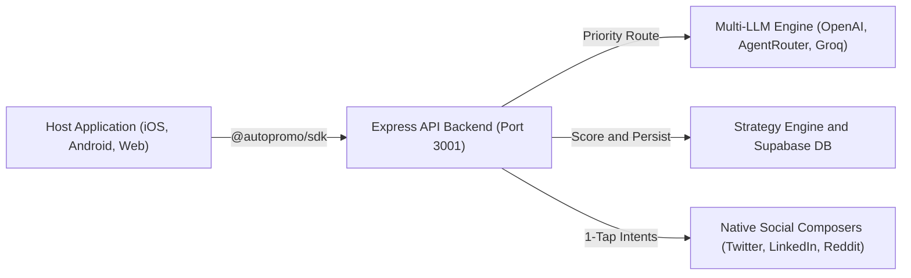
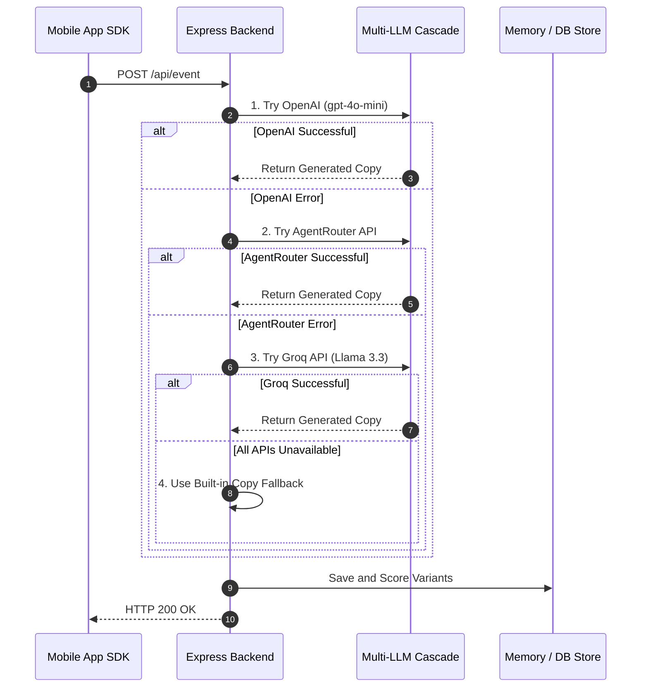

<div align="center">


# AutoPromo SDK


**The Autonomous Promotion Layer for Mobile & Web Applications**

*Transform application milestones into high-converting social threads and AI artwork via 1-tap human-in-the-loop publishing.*

[Live Deployment](#live-production-deployments) • [Executive Summary](#executive-summary) • [Project Questionnaire](#project-questionnaire) • [System Architecture](#system-architecture) • [SDK Integration](#sdk-integration) • [Multi-LLM Pipeline](#multi-llm-fallback-pipeline) • [Environment Setup](#environment--configuration)

</div>

---

## Live Production Deployments

| Layer / Component | Hosting Provider | Live URL | Description |
|---|---|---|---|
| **Frontend Dashboard** | Cloudflare Workers / Pages | [https://autopromo-dashboard.kanishjebamathew-m.workers.dev](https://autopromo-dashboard.kanishjebamathew-m.workers.dev) | Production React 19 SPA dashboard with live telemetry and ad studio |
| **Backend API Server** | Render Web Service | [https://autopromo-dashboard.onrender.com](https://autopromo-dashboard.onrender.com) | Express Node.js backend executing LLM generation, Supabase persistence, & scoring |

---

## Executive Summary

AutoPromo is a drop-in developer SDK and analytics dashboard that captures key application milestones—such as product launches, version releases, 5-star user reviews, and download goals—and converts them into platform-native promotional copy and ad artwork.

### Core Capabilities

* **Zero Terms-of-Service Risk**: Avoids third-party account delegation and browser automation. AutoPromo constructs pre-filled native platform composition intents (`twitter.com/intent/tweet`, `wa.me`, `linkedin.com/sharing`). A human retains final 1-tap publishing control.
* **Multi-LLM Fallback Engine**: Sequential execution cascade across AI providers (**OpenAI `gpt-4o-mini`** $\rightarrow$ **AgentRouter** $\rightarrow$ **Groq `Llama-3.3-70B`** $\rightarrow$ **Structured Copy Fallback**) ensuring high availability.
* **Ad and Poster Studio**: Integrates **Google Gemini Imagen 3** for AI background artwork and visual poster rendering across Square (1:1), Landscape (16:9), and Story (9:16) formats.
* **Adaptive Strategy Engine**: Ranks post variants dynamically based on historical publishing performance:
  $$\text{Score} = w_{\text{base}}(\text{Event}, \text{Platform}) + 0.5 \times \left( \frac{\text{Times Chosen}}{\text{Times Shown} + 1} \right)$$

---

## Project Questionnaire

*(Also available as a standalone document in [`questionnaire.md`](./questionnaire.md))*

### 1. What does your application/service do?
AutoPromo SDK is an autonomous, AI-driven promotion layer and growth analytics dashboard for mobile and web applications. It captures real-time application milestones (such as product launches, version releases, 5-star user reviews, and download goals) via a drop-in 3-line SDK (`@autopromo/sdk`), generates platform-tailored promotional copy across 6 social networks (Twitter/X, LinkedIn, Reddit, WhatsApp, Telegram, Facebook) and commercial AI ad poster artwork using Google Gemini Imagen 3, ranks content variants using an adaptive Strategy Engine, and opens native platform composition screens so developers can publish in 1-tap with **Zero Terms-of-Service Risk**.

### 2. Who is the target audience?
Mobile app developers, web application founders, indie hackers, growth marketers, and software product teams who want to consistently promote their product milestones without spending hours writing social threads, designing graphics, or risking social account bans through fragile automation bots.

### 3. Which countries are the expected buyers of this service?
Primarily major software development and startup ecosystems — the **United States**, **United Kingdom**, **Canada**, **Australia**, **India**, and **Western Europe** (Germany, France, Netherlands) — where consumer mobile apps launch frequently and where App Store, Product Hunt, and social tech culture are strongest. Secondary growth markets include **Southeast Asia** (Singapore, Indonesia) and **East Asia** (Japan, South Korea). Because AutoPromo SDK is distributed via NPM as a global web/mobile SDK and supports multi-locale social platforms, it is completely region-agnostic and accessible worldwide.

### 4. Who are your competitors?
AutoPromo SDK replaces a fragmented patchwork of point tools that developers currently stitch together:
* **Social Scheduling & Management Tools** (*Buffer, Hootsuite, Sprout Social*) — which require manual content creation and expensive paid platform API integrations.
* **Generic AI Copywriting Tools** (*Jasper, Copy.ai*) — which lack direct application event context, SDK hooks, and real-time product trigger telemetry.
* **Unofficial Automation Bots & Web Scrapers** — which carry high risks of account suspension or permanent social media bans due to platform API restrictions.
* **Graphic Design & Banner Templates** (*Canva*) — which require manual graphic editing for every release.

AutoPromo SDK's primary competition is this inefficient patchwork of point tools combined with spreadsheets and manual effort.

### 5. What is your advantage?
Three core architectural differentiators:
1. **Zero ToS Risk (1-Tap Human-in-the-Loop)**: Avoids third-party account delegation, password storage, or unauthorized web scraping. AutoPromo constructs pre-filled native platform composition intent URLs (`twitter.com/intent/tweet`, `wa.me`, `linkedin.com/sharing`), keeping a human in final 1-tap publishing control.
2. **Resilient Multi-LLM Fallback Matrix**: Features a sequential execution cascade across AI providers (**OpenAI `gpt-4o-mini`** $\rightarrow$ **AgentRouter** $\rightarrow$ **Groq `Llama 3.3 70B`** $\rightarrow$ **Structured Copy Fallback**), guaranteeing 100% uptime for post generation.
3. **Adaptive Strategy Engine & AI Poster Studio**: Ranks post variants dynamically based on historical publishing performance ($\text{Score} = \text{Base Weight} + 0.5 \times \frac{\text{Chosen}}{\text{Shown}}$) and integrates Google Gemini Imagen 3 for 1-click multi-aspect ratio ad banner export (**Square 1:1**, **Landscape 16:9**, **Story 9:16**).

---

## System Architecture



---

## Live Application Directory

| Route Path | Screen | Purpose |
|---|---|---|
| `/` | Landing Page | Overview, platform matrix, and sandbox billing |
| `/apps` | Apps Directory | Multi-app overview and one-click app connection |
| `/apps/:appId` | App Studio | Live SDK event trigger buttons, ranked posts grid, and platform filters |
| `/apps/:appId/ads` | Ad & Poster Studio | AI background artwork generator and multi-ratio exporter |
| `/apps/:appId/events/:eventId` | Event Breakdown | Full view of all copy variants generated for a single event |
| `/analytics` | Strategy Analytics | Platform win rates, performance metrics, and weight distributions |
| `/live/:appId` | Terminal Live Feed | Dark-mode developer terminal streaming live SDK event broadcasts |
| `/docs` | SDK Documentation | Interactive playground, code samples, and downloadable `sdk.ts` |
| `/settings` | Settings & Billing | App SDK API keys, subscription plan management, and billing receipts |
| `/share/:eventId` | OpenGraph Preview | OpenGraph preview cards tailored for LinkedIn and Facebook sharing |

---

## Multi-LLM Fallback Pipeline

AutoPromo implements a sequential fallback chain across LLM providers to maintain complete reliability:



---

## SDK Integration

### 1. Installation
```bash
npm install @autopromo/sdk
```

### 2. Initialize in Host Application
```typescript
import { AutoPromo } from "@autopromo/sdk";

AutoPromo.init({
  appId: "ap_live_2b81ef40c7aa",   // From Dashboard -> Settings
  apiUrl: "https://autopromo-dashboard.onrender.com/api", // Live Render Backend API
  appUrl: "https://focustimer.app",
});
```

### 3. Track Product Events
```typescript
// Major Version Release
await AutoPromo.trackVersion({
  build: "v2.0.0",
  notes: "Added Dark Mode, 50% faster export speeds, and cloud sync.",
});

// Milestone Reached
await AutoPromo.trackMilestone({
  label: "10,000 Active Users",
  count: 10000,
});

// 5-Star Review Highlight
await AutoPromo.trackReview({
  rating: 5,
  author: "Alex R.",
  text: "The best focus timer app I've used this year.",
});

// Fetch & Trigger Share Sheet
const result = await AutoPromo.trackEvent("launch");
if (result.posts && result.posts.length > 0) {
  await AutoPromo.openShareSheet(result.posts[0].content);
}
```

---

## Supported Social Platforms

| Platform | Composition Strategy | Primary Intent Target |
|---|---|---|
| Twitter / X | Web Intent Deep Link | `https://twitter.com/intent/tweet?text={text}` |
| LinkedIn | OpenGraph Share Card | `https://www.linkedin.com/sharing/share-offsite/?url={shareUrl}` |
| Reddit | Text / Link Submission | `https://www.reddit.com/submit?title={title}&text={body}` |
| WhatsApp | Native Share Sheet | `https://wa.me/?text={encodedText}` |
| Telegram | Instant Share URL | `https://t.me/share/url?url={url}&text={text}` |
| Facebook | Sharer Dialog | `https://www.facebook.com/sharer/sharer.php?u={shareUrl}` |

---

## Environment & Configuration

All secret API keys are restricted to `server/.env` and are never exposed to client-side bundles.

### `server/.env` Reference

```bash
cd server
cp .env.example .env
```

| Variable | Type | Description | Source |
|---|---|---|---|
| `OPENAI_API_KEY` | Secret | Primary LLM Key for GPT-4o-mini copy generation | platform.openai.com |
| `AGENTROUTER_API_KEY` | Secret | Secondary LLM provider key | agentrouter.org |
| `GROQ_API_KEY` | Secret | Groq Llama-3.3-70B provider key | console.groq.com |
| `GEMINI_API_KEY` | Secret | Google Gemini Imagen 3 key for poster artwork | aistudio.google.com |
| `NEXT_PUBLIC_SUPABASE_URL` | Public | Supabase project URL | Supabase Dashboard |
| `SUPABASE_SERVICE_ROLE_KEY` | Secret | Supabase service_role secret key | Supabase Dashboard |
| `DISCORD_WEBHOOK_URL` | Secret | Discord channel webhook URL for auto-posting | Discord Settings |
| `PORT` | Public | Express backend port (Default: `3001`) | `3001` |
| `FRONTEND_URL` | Public | Dashboard URL for CORS configuration | `https://autopromo-dashboard.kanishjebamathew-m.workers.dev` |

---

## Local Development Setup

### 1. Launch Express Backend Server (Port 3001)

```bash
cd server
npm install
cp .env.example .env
npm run dev
```

### 2. Launch Dashboard Frontend (Port 8080)

```bash
npm install
npm run dev
```

### 3. Build SDK Package (`@autopromo/sdk`)

```bash
cd packages/autopromo-sdk
npm install
npm run build
```

### 4. Launch Expo Mobile Demo Application

```bash
cd autopromo-demo
npm install
npx expo start
```

---

## Subscription Plans

| Feature | Free Sandbox | Builder Pro ($12/mo) | Agency ($39/mo) |
|---|---|---|---|
| Monthly AI Posts | 20 posts / month | 200 posts / month | Unlimited |
| Connected Apps | 1 app | 3 apps | Unlimited |
| LLM Provider Priority | Standard | Priority Queue | Priority Queue |
| Ad Poster Studio | Canvas Layouts | Gemini Imagen 3 | Custom Theme Builder |
| Analytics & Export | Basic | Strategy Engine | White-Label PDF & CSV |

---

## License and Credits

* **Event**: HackOnVibe 2026
* **License**: MIT License
* **Core Technologies**: TanStack Start, React 19, TypeScript, Tailwind CSS v4, Express.js, Supabase, OpenAI, Google Gemini, Groq.
