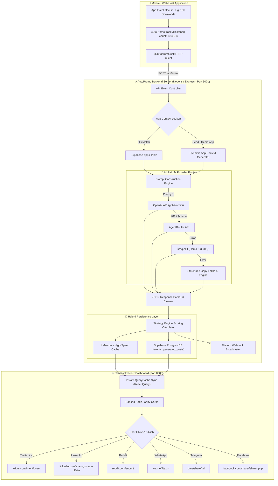
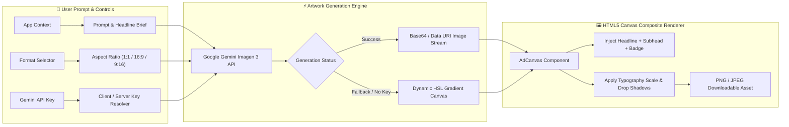

<div align="center">

```
  █████╗ ██╗   ██╗████████╗██████╗ ██████╗ ██╗    ██╗███████╗██████╗ 
 ██╔══██╗██║   ██║╚══██╔══╝██╔══██╗██╔══██╗██║    ██║██╔════╝██╔══██╗
 ███████║██║   ██║   ██║   ██████╔╝██████╔╝██║ █╗ ██║█████╗  ██████╔╝
 ██╔══██║██║   ██║   ██║   ██╔═══╝ ██╔══██╗██║███╗██║██╔══╝  ██╔══██╗
 ██║  ██║╚██████╔╝   ██║   ██║     ██║  ██║╚███╔███╔╝███████╗██████╔╝
 ╚═╝  ╚═╝ ╚═════╝    ╚═╝   ╚═╝     ╚═╝  ╚═╝ ╚══╝╚══╝ ╚══════╝╚═════╝ 
```

### **THE AUTONOMOUS PROMOTION ENGINE FOR APP DEVELOPERS**
*Turn Product Moments into High-Converting Social Threads & AI Ad Artwork in 1-Tap*

[](https://opensource.org/licenses/MIT)
[](https://www.typescriptlang.org/)
[](https://react.dev/)
[](https://openai.com/)
[](https://aistudio.google.com/)
[](https://supabase.com/)
[](https://expressjs.com/)

[🔥 Live Demo Directory](#-live-demo-navigation) • [⚡ 3-Second Executive Summary](#-3-second-executive-summary) • [🏗️ Master System Architecture](#-master-system-architecture) • [🚀 3-Line SDK Integration](#-3-line-sdk-integration) • [🧠 Multi-LLM Fallback Cascade](#-multi-llm-provider-fallback-cascade) • [🎨 Ad & Poster Studio](#-ad--poster-studio) • [⚙️ Setup & Deployment](#-environment--configuration)

</div>

---

## ⚡ 3-Second Executive Summary

Building a great product is only half the battle—**promoting it consistently is where most developers fail.**

**AutoPromo SDK** is a lightweight, drop-in promotion layer that listens to key application milestones (product launches, version updates, 5★ reviews, user milestones) and automatically transforms them into viral, platform-native social media threads and AI promotional posters.

### 🌟 The 4 Pillars of AutoPromo
1. **🛡️ 100% Zero ToS Risk (1-Tap Human-in-the-Loop)**: Never hands credentials to third-party automation tools or risks account bans. AutoPromo generates pre-filled native platform composition intents (`twitter.com/intent/tweet`, `wa.me`, `linkedin.com/sharing`). A human makes the final 1-tap publish decision.
2. **🧠 Resilient Multi-LLM Provider Engine**: Features an ironclad sequential fallback cascade: **OpenAI `gpt-4o-mini`** $\rightarrow$ **AgentRouter** $\rightarrow$ **Groq `Llama-3.3-70B`** $\rightarrow$ **Structured Template Fallback**. Post generation *never* crashes or fails.
3. **🎨 AI Ad & Poster Studio**: Direct integration with **Google Gemini Imagen 3** for generating commercial-grade promotional poster artwork across Square (1:1), Landscape (16:9), and Story (9:16) formats.
4. **📊 Adaptive Strategy Engine**: A continuous feedback loop that ranks promotional copy based on actual historical publishing choices:
$$\text{Score} = w_{\text{base}}(\text{Event}, \text{Platform}) + 0.5 \times \left( \frac{\text{Times Chosen}}{\text{Times Shown} + 1} \right)$$

---

## 🔥 Live Demo Navigation

The AutoPromo workspace provides a full suite of interactive tools, live dashboards, and developer sandboxes:

```
http://localhost:8080/ (Dashboard Frontend)
http://localhost:3001/ (Express Backend API)
```

| Route Path | Screen / Feature | Key Functionality |
|---|---|---|
| `/` | **Landing & Showcase** | Interactive feature tour, platform matrix, & sandbox billing preview |
| `/apps` | **Apps Directory** | Overview of all connected apps with real-time status indicators |
| `/apps/:appId` | **App Studio & Feed** | Live SDK event trigger buttons, ranked posts grid, & platform filters |
| `/apps/:appId/ads` | **Ad & Poster Studio** | AI background artwork generator, palette selector, & multi-ratio export |
| `/apps/:appId/events/:eventId` | **Event Deep-Dive** | Complete breakdown of all 12 copy variants generated for a single event |
| `/analytics` | **Strategy Analytics** | Global performance metrics, platform win rates, & ranking weight graphs |
| `/live/:appId` | **Terminal Live Feed** | Dark-mode developer terminal streaming live SDK event broadcasts |
| `/docs` | **SDK Integration Guide** | Interactive test playground, code snippets, & 1-click `sdk.ts` download |
| `/settings` | **Settings & Billing** | App SDK API keys, subscription management, plan upgrade/cancel, & receipts |
| `/share/:eventId` | **OG Share Preview** | Dynamic OpenGraph preview cards tailored for LinkedIn & Facebook sharing |

---

## 🏗️ Master System Architecture

AutoPromo bridges mobile/web applications, distributed AI providers, database persistence, and native mobile composition handlers.

### 1. Complete End-to-End Telemetry Pipeline



---

### 2. Ad & Poster Studio Generation Pipeline



---

## 🧠 Multi-LLM Provider Fallback Cascade

To ensure absolute reliability during high-traffic launches or live hackathon demonstrations, AutoPromo never relies on a single AI provider.

```mermaid
sequenceDiagram
    autonumber
    participant App as Mobile App SDK
    participant Server as Express Backend
    participant OpenAI as OpenAI (gpt-4o-mini)
    participant AgentRouter as AgentRouter API
    participant Groq as Groq (Llama 3.3)
    participant Cache as Memory / DB Store

    App->>Server: POST /api/event { type: "launch" }
    
    rect rgb(20, 40, 30)
        Note over Server,OpenAI: Attempt 1: OpenAI GPT-4o-mini
        Server->>OpenAI: POST /v1/chat/completions (response_format: json)
        alt Success (200 OK)
            OpenAI-->>Server: Return Structured JSON Copy
        else Error 401 / 429 / 500
            OpenAI-->>Server: Error Response
        end
    end

    rect rgb(40, 30, 20)
        Note over Server,AgentRouter: Attempt 2: AgentRouter Backup
        alt OpenAI Failed
            Server->>AgentRouter: POST /v1/chat/completions
            AgentRouter-->>Server: Return Copy JSON
        end
    end

    rect rgb(30, 20, 40)
        Note over Server,Groq: Attempt 3: Groq Llama 3.3 70B
        alt AgentRouter Failed
            Server->>Groq: POST /v1/chat/completions
            Groq-->>Server: Return Copy JSON
        end
    end

    rect rgb(20, 20, 20)
        Note over Server,Cache: Attempt 4: Local Template Generator
        alt All LLMs Failed
            Server->>Server: Execute generateFallbackPosts()
        end
    end

    Server->>Cache: Save & Score Posts
    Server-->>App: HTTP 200 OK { ok: true, posts: [...] }
```



---

## 🚀 3-Line SDK Integration

### 1. Installation
```bash
npm install @autopromo/sdk
```

### 2. Initialize in Host App
```typescript
import { AutoPromo } from "@autopromo/sdk";

AutoPromo.init({
  appId: "ap_live_2b81ef40c7aa",   // Generated in Dashboard -> Settings
  apiUrl: "http://localhost:3001", // AutoPromo Backend Server URL
  appUrl: "https://focustimer.app",
});
```

### 3. Emit Real Product Moments
```typescript
// 🚀 Major Product Release
await AutoPromo.trackVersion({
  build: "v2.0.0",
  notes: "Shipped Dark Mode, 50% faster export speeds, and cloud sync!",
});

// ⚡ Milestone Achieved
await AutoPromo.trackMilestone({
  label: "10,000 Active Users",
  count: 10000,
});

// ⭐ 5-Star Review Highlight
await AutoPromo.trackReview({
  rating: 5,
  author: "Alex R.",
  text: "The best focus timer app I've used this year!",
});

// 🎯 Immediate 1-Tap Share Sheet Trigger
const result = await AutoPromo.trackEvent("launch");
if (result.posts && result.posts.length > 0) {
  await AutoPromo.openShareSheet(result.posts[0].content);
}
```

---

## 🌐 Supported Social Platforms & Deep Link Matrix

AutoPromo formats every post specifically for the character limits, line breaks, hashtag rules, and tone expectations of each social network:

| Platform | Native Intent Builder Format | Features Supported |
|---|---|---|
| **Twitter / X** | `https://twitter.com/intent/tweet?text={text}` | Auto-hashtag extraction, 280-char limit |
| **LinkedIn** | `https://www.linkedin.com/sharing/share-offsite/?url={shareUrl}` | Professional copy, headline, OG preview card |
| **Reddit** | `https://www.reddit.com/submit?title={title}&text={body}` | Markdown formatting, r/SideProject friendly copy |
| **WhatsApp** | `https://wa.me/?text={encodedText}` | Direct mobile app deep-linking & group broadcast |
| **Telegram** | `https://t.me/share/url?url={url}&text={text}` | Channel broadcast formatting & emoji styling |
| **Facebook** | `https://www.facebook.com/sharer/sharer.php?u={shareUrl}` | Community post layout & link previews |

---

## 🎨 Ad & Poster Studio

The **Ad & Poster Studio** (`/apps/:appId/ads`) allows developers and indie hackers to generate high-converting promotional banners in seconds:

* 🖼️ **Google Gemini Imagen 3 Integration**: Generates commercial background imagery based on your prompt.
* 🎨 **Dynamic Palette Styling**: Choose between *Dark Modern*, *Neon Cyber*, *Minimalist Light*, or *Vibrant Gradient* themes.
* 📐 **Multi-Aspect Ratio Canvas**:
  * **Square (1:1)** — `1080 × 1080` (Instagram, Twitter, LinkedIn)
  * **Landscape (16:9)** — `1200 × 630` (Facebook, Web Banners, ProductHunt)
  * **Story (9:16)** — `1080 × 1920` (Instagram Stories, TikTok, Mobile Reels)
* 💾 **1-Click High-Res PNG Export**: Rendered directly in-browser using HTML5 Canvas.

---

## ⚙️ Environment & Configuration

All secret credentials live exclusively in `server/.env` and are **never** bundled into public frontend code.

### `server/.env` Specification

```bash
cd server
cp .env.example .env
```

| Variable | Type | Description | Where to Obtain |
|---|---|---|---|
| `OPENAI_API_KEY` | Secret | **Primary LLM Key** for GPT-4o-mini copy generation | [platform.openai.com](https://platform.openai.com) |
| `AGENTROUTER_API_KEY` | Secret | Backup LLM provider key | [agentrouter.org](https://agentrouter.org) |
| `GROQ_API_KEY` | Secret | Groq Llama-3.3-70B provider key | [console.groq.com](https://console.groq.com) |
| `GEMINI_API_KEY` | Secret | Google Gemini Imagen 3 key for poster artwork | [aistudio.google.com](https://aistudio.google.com) |
| `NEXT_PUBLIC_SUPABASE_URL` | Public | Supabase project URL | Supabase Dashboard $\rightarrow$ Settings $\rightarrow$ API |
| `SUPABASE_SERVICE_ROLE_KEY` | Secret | Supabase `service_role` secret (bypasses RLS) | Supabase Dashboard $\rightarrow$ Settings $\rightarrow$ API |
| `DISCORD_WEBHOOK_URL` | Secret | Discord channel webhook URL for auto-posting | Discord Channel Settings $\rightarrow$ Integrations |
| `PORT` | Public | Express backend port (Default: `3001`) | `3001` |
| `FRONTEND_URL` | Public | Dashboard URL for CORS configuration | `http://localhost:8080` |

---

## 🛠️ Complete Workspace Setup Guide

### 1. Launch Express Backend Server (Port 3001)

```bash
cd server
npm install
cp .env.example .env     # Fill in your API keys
npm run dev
```
*Health Check*: Verify at `http://localhost:3001/health`

### 2. Launch Dashboard Frontend (Port 8080)

In a new terminal window:

```bash
npm install
npm run dev
```
*Dashboard*: Access at `http://localhost:8080`

### 3. Build SDK Package (`@autopromo/sdk`)

```bash
cd packages/autopromo-sdk
npm install
npm run build
```

### 4. Launch Expo Mobile Demo App

```bash
cd autopromo-demo
npm install
npx expo start
```
*Scan the QR code with Expo Go on iOS or Android.*

---

## 💳 Sandbox Subscription Plans

| Feature / Limit | Free Sandbox | Builder Pro ($12/mo) | Agency ($39/mo) |
|---|---|---|---|
| **Monthly AI Posts** | 20 posts / mo | 200 posts / mo | **Unlimited** |
| **Connected Apps** | 1 app | 3 apps | **Unlimited** |
| **LLM Provider Priority** | Standard | Priority Queue | Priority Queue |
| **Ad Poster Studio** | Canvas Layouts | Gemini Imagen 3 | Custom Theme Builder |
| **Analytics & Export** | Basic | Strategy Engine | **White-Label PDF & CSV** |

---

## 📄 License & Team Credits

* **Hackathon**: [HackOnVibe 2026](https://hackonvibe.com)
* **License**: MIT Open Source License
* **Core Stack**: TanStack Start, React 19, TypeScript, Tailwind CSS v4, Express.js, Supabase, OpenAI, Google Gemini, Groq.
